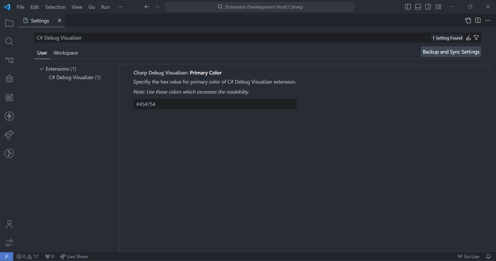

# C# Debug Visualizer

It can be used for visualizing the basic datatype variables, including `DataTable` for C# only. It is simple to install and run, and it is free to use.

## Install

Search **'C# Debug Visualizer'** in the extension tab and install it, and you are ready to use it.

## Features

It can visualize the system-defined datatypes along with the DataTable, DataColumn, and DataRow from System.Data class and JSON object from Newtonsoft.Json.Linq class.

For example, one can select the variable by putting a cursor over it and run the Visualize command in context by opening it by right-clicking or by pressing `Shift+Alt+V`.

Moreover, you can visualize a data table too, even with the pagination feature.

If the result of the variable is too long to scroll and you are *Lazy*, then you can use the 'Word Wrap' feature to *let your fingers and arm rest!*

Even feeling lazy to copy the result? Then try the 'Copy to Clipboard' feature, and it will copy the result to the clipboard.

Furthermore, you can save the output of the datatable in CSV too, with just one click on 'Save As CSV' and at your preferred location.

There is an vs code inbuilt searching feature too. You only have to press `Ctrl + F` and then enter your search text.

## Requirements

There is no need for any additional required resources, just VS code and this extension.

- Your C# code must be in debug mode.

## Extension Settings

If you want to change settings for this extension, then you can change it from settings for this extension.

For example:

This extension contributes the following settings:

* `charpDebugVisualizer.primaryColor`: Set the primary color for this extension. 
* Default color is `#454754`.

> Tip: Use those colors, which increase your readability.

## Known Issues

This extension is supported only for basic variables like `Integer, Character, String, Boolean, Array, DataRow, DataColumn, DataTable`, and some other variable types. So please be patient and feel free to contact us if you face any issues, because this is an initial version.

## Release Notes

This are our version details.

### 1.0.0

The initial release of this extension supports basic variable types, including DataTable.

---

## Contributors
- [Krishna Tamakuwala](https://github.com/krishnatamakuwala)

- [Piyush Katariya](https://github.com/PiyushKatariya)

**Enjoy!**