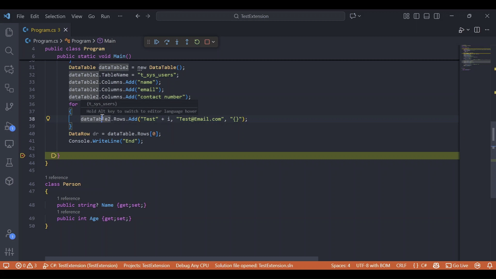
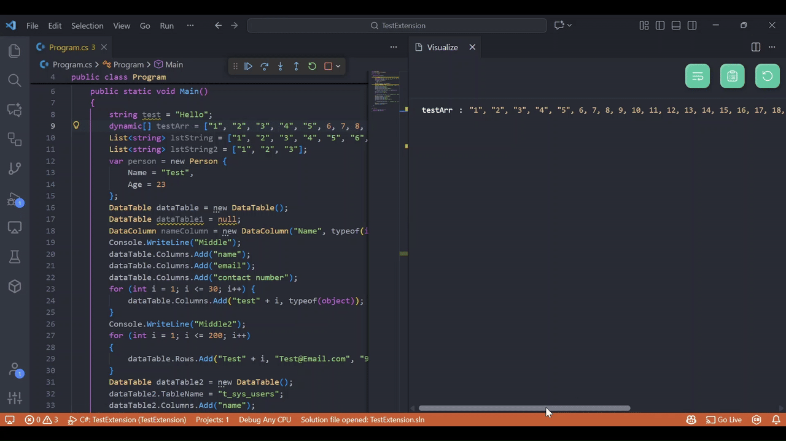
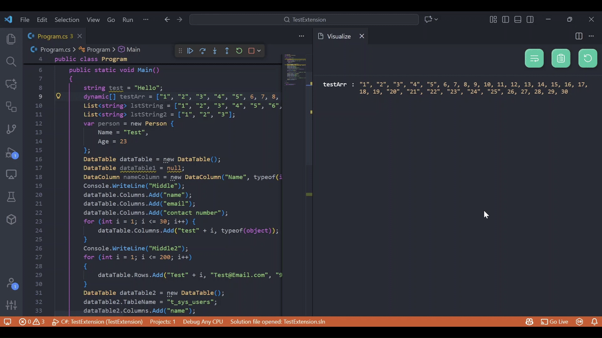
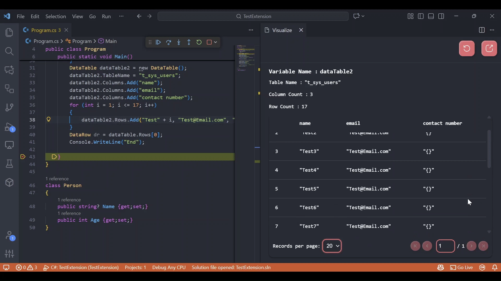
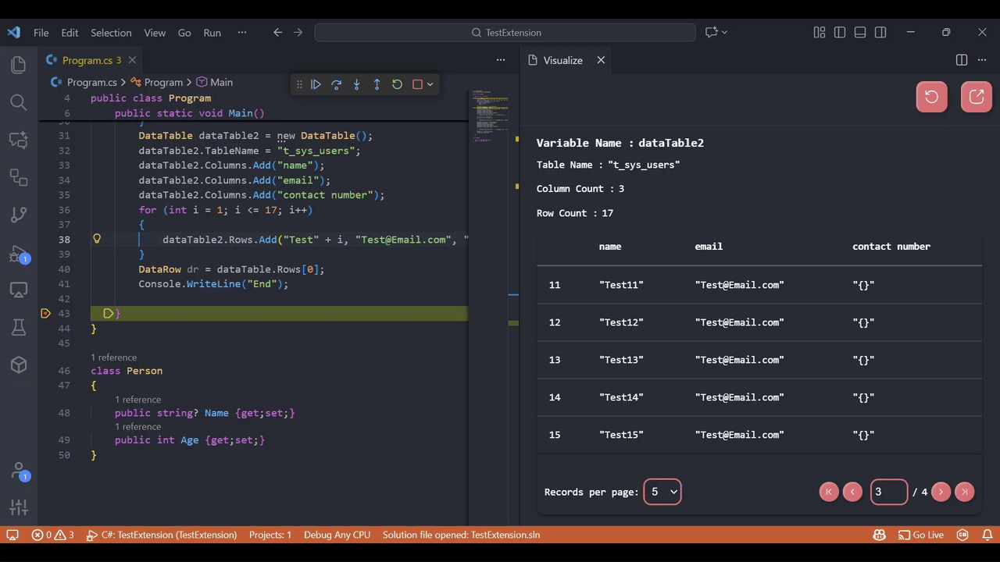
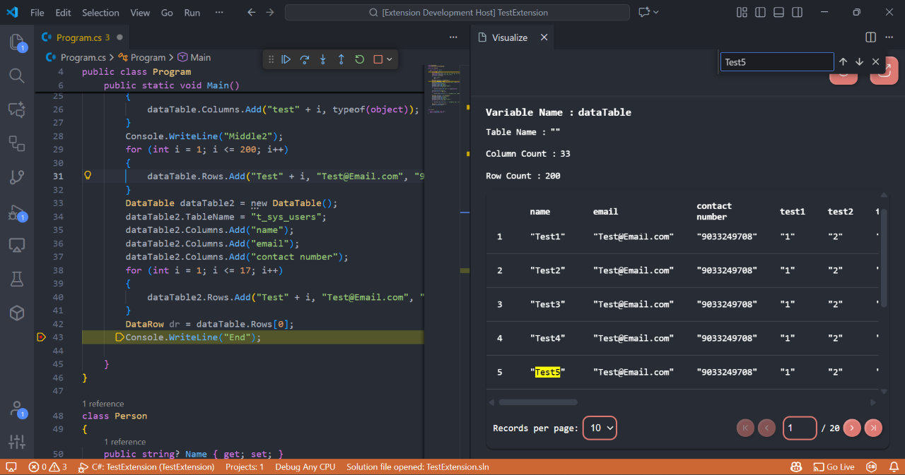
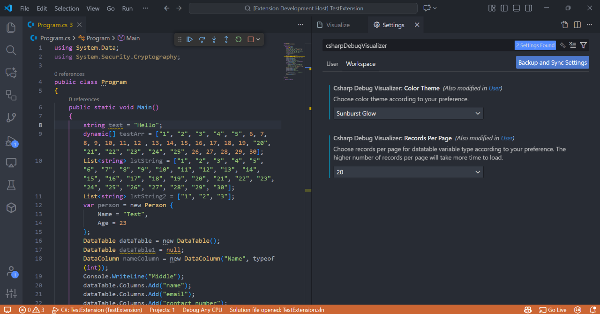

# C# Debug Visualizer

**C# Debug Visualizer** is a lightweight, free, and easy-to-use Visual Studio Code extension for visualizing C# variables during debugging including complex types such as DataTable, DataRow, and DataColumn. It enhances your debugging workflow by offering clean, interactive visualization features right inside VS Code.

## Installation

1. Open Extensions in VS Code.
2. Search for “C# Debug Visualizer”.
3. Install the extension, no additional setup required.

You're now ready to visualize C# variables instantly during debugging.

## Features

### Visualize Variables Instantly

Supports visualization of most system-defined data types, including:

- Primitive types (int, string, bool, etc.)
- Arrays
- DataTable, DataRow, DataColumn (from System.Data)

How to use:
- Place your cursor on the variable
- Right-click and then Visualize _or_
press `Shift + Alt + V`

### Word Wrap for Long Outputs

Long output? Enable Word Wrap with one click to improve readability.

### One-Click Copy to Clipboard

Copy full visualized output to clipboard effortlessly.

### DataTable Viewer with Pagination

View large DataTables comfortably with built-in pagination.

### Export DataTable to CSV

Save DataTable results directly as a CSV file with Save As CSV.

### Native VS Code Search Support

Use `Ctrl + F` inside the viewer to search through the output.

## Requirements

No external dependencies required.
Simply ensure:
- You are using Visual Studio Code
- Your C# application is running in Debug mode

## Extension Settings

You can customize the UI to match your preferences through VS Code settings.

Example:

Available setting:

| Setting | Description | Default |
| ------- | ----------- | ------- |
| `csharpDebugVisualizer.colorTheme` | Choose color theme according to your preference. | Oceanic Breeze |
| `csharpDebugVisualizer.recordsPerPage` | Choose records per page for datatable variable type according to your preference. The higher number of records per page will take more time to load. | 10 |

## Known Issues

This extension currently supports common and basic .NET types such as:
- Primitives
- Arrays
- DataTable, DataRow, DataColumn

Future versions will expand support for additional data structures.
If you encounter issues or unsupported types, feel free to reach out, this is an early version and your feedback helps us improve.

## Release Notes

Refer to the CHANGELOG for detailed version history.

## Contributors
- [Krishna Tamakuwala](https://github.com/krishnatamakuwala)

- [Piyush Katariya](https://github.com/PiyushKatariya)